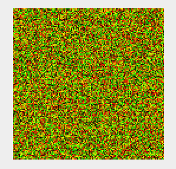
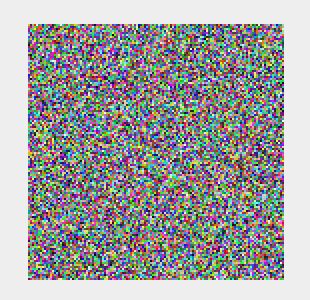

# UnifyID Coding Challenge!

### BitMap

I used Java's random number generator at first (since generating one BitMap would use up over half my daily quota...).

The difference between the two images is pretty interesting (though maybe the Java random number generator version doesn't look very good because of how carelessly I generated random integers? :/ )

Using Java's random number generator:

Using random.org:

### WhiteNoise

The wav file was created using Java's random number generator (I used up my random.org quote for BitMap). I wrote a method detailing how I would use random.org to generate the wav file though. :)

